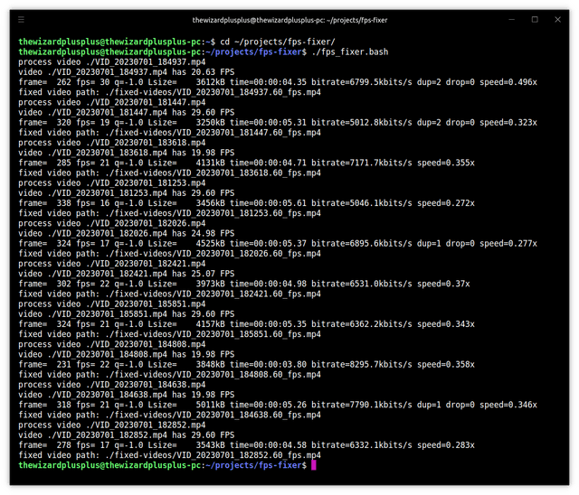

# FPS Fixer



The utility for fixing FPS in videos.

## Features

- search of videos:
  - filtering by a video file extension;
  - skipping videos with near target FPS;
- fixing FPS in videos that have FPS less than or greater than the specified FPS;
- automatic directory creation for fixed videos;
- the mode without real processing of videos, only with search of them and check of their FPS;
- logging:
  - logging of a video name and FPS at the beginning of processing;
  - logging of a fixed video path at the end of processing.

## Requirements

- [FFmpeg](https://ffmpeg.org/) >=4.4.2, <5.0.

## Usage

```
$ fps_fixer.bash -v | --version
$ fps_fixer.bash -h | --help
$ fps_fixer.bash [options] [<path>]
```

Options:

- `-v`, `--version` &mdash; show the version;
- `-h`, `--help` &mdash; show the help;
- `-e EXTENSION`, `--extension EXTENSION` &mdash; video file extension (default: `mp4`);
- `-b PATH`, `--base-path PATH` &mdash; base path for fixed videos (should be relative to argument `<path>`; default: `./fixed-videos`);
- `-f FPS`, `--fps FPS` &mdash; target FPS (default: `60`);
- `-E EPSILON`, `--epsilon EPSILON` &mdash; allowable error when comparing FPS (default: `2`);
- `--no-process` &mdash; don't process videos, only search for them and check their FPS.

Arguments:

- `<path>` &mdash; base path to original videos (default: `.`).

## License

The MIT License (MIT)

Copyright &copy; 2023 thewizardplusplus
